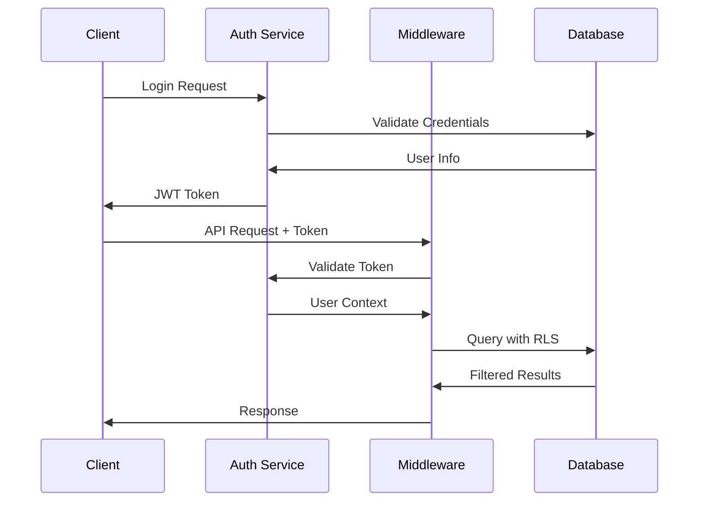

# Multi-Tenant Architecture Documentation

## Table of Contents

1. [Overview](#overview)
2. [Architecture Design](#architecture-design)
3. [Data Isolation Strategy](#data-isolation-strategy)
4. [Security Implementation](#security-implementation)
5. [API Design](#api-design)
6. [Permission System](#permission-system)
7. [Middleware Stack](#middleware-stack)
8. [Database Schema](#database-schema)
9. [Testing Strategy](#testing-strategy)
10. [Deployment Guide](#deployment-guide)
11. [Monitoring and Observability](#monitoring-and-observability)
12. [Troubleshooting](#troubleshooting)

## Overview

The NextSaaS multi-tenant architecture provides secure, scalable tenant isolation while maintaining performance and cost efficiency. The architecture supports three levels of tenancy:

- **Organization Level**: Top-level tenant boundary with complete data isolation
- **Workspace Level**: Logical grouping within organizations for project organization
- **Project Level**: Individual projects within workspaces with granular permissions

### Key Features

- **Row-Level Security (RLS)**: Database-level tenant isolation
- **Hierarchical Permissions**: Role-based access control with inheritance
- **API Rate Limiting**: Per-tenant rate limiting and usage tracking
- **Security Monitoring**: Real-time threat detection and response
- **Audit Logging**: Comprehensive audit trails for compliance
- **Multi-Region Support**: Global deployment with data residency compliance

## Architecture Design

### System Overview

```
┌────────────────┐
│   Web Frontend     │
│   (Next.js)       │
└───────┬────────┘
        │
┌───────┴────────┐
│   API Gateway      │
│   (Middleware)     │
├────────────────┤
│ • Auth Validation  │
│ • Tenant Context   │
│ • Rate Limiting    │
│ • Security Monitor │
│ • Permission Check │
└───────┬────────┘
        │
┌───────┴────────┐
│   Application      │
│   Services         │
└───────┬────────┘
        │
┌───────┴────────┐
│   Database         │
│   (Supabase)       │
├────────────────┤
│ • RLS Policies     │
│ • Multi-Schema     │
│ • Audit Tables     │
└────────────────┘
```

### Component Architecture

#### Frontend Layer
- **Next.js Application**: Server-side rendering with client-side hydration
- **Tenant Context**: React context for tenant-aware components
- **Permission Guards**: Component-level permission enforcement
- **Error Boundaries**: Graceful error handling with tenant context

#### API Layer
- **Next.js API Routes**: RESTful API with tenant-aware routing
- **Middleware Stack**: Composable middleware for cross-cutting concerns
- **Type-Safe APIs**: Full TypeScript support with generated types
- **GraphQL Support**: Optional GraphQL layer for complex queries

#### Data Layer
- **Supabase**: PostgreSQL with built-in auth and real-time features
- **Row-Level Security**: Database-enforced tenant isolation
- **Audit Logging**: Automatic audit trail generation
- **Real-time Subscriptions**: Tenant-scoped real-time updates

## Data Isolation Strategy

### Row-Level Security (RLS) Implementation

All tenant data is isolated using PostgreSQL's Row-Level Security feature:

```sql
-- Example RLS policy for organizations
CREATE POLICY "Users can only access their organization data" 
ON organizations FOR ALL 
USING (
  id IN (
    SELECT organization_id 
    FROM organization_members 
    WHERE user_id = auth.uid()
  )
);

-- Example RLS policy for workspaces
CREATE POLICY "Users can only access workspaces in their organization" 
ON workspaces FOR ALL 
USING (
  organization_id IN (
    SELECT organization_id 
    FROM organization_members 
    WHERE user_id = auth.uid()
  )
);
```

### Tenant Context Propagation

Every API request carries tenant context through the middleware stack:

```typescript
interface TenantContext {
  organizationId: string
  userId: string
  role: string
  permissions: string[]
}

// Context is automatically injected into all API handlers
export default async function handler(
  req: NextRequest,
  context: TenantContext
) {
  // All database queries automatically include tenant context
  const workspaces = await supabase
    .from('workspaces')
    .select('*')
    .eq('organization_id', context.organizationId)
}
```

### Data Segregation Patterns

1. **Shared Database, Shared Schema**: All tenants share tables with tenant_id column
2. **Shared Database, Separate Schema**: Each tenant has dedicated schema
3. **Separate Database**: Each tenant has dedicated database (for enterprise)

The system uses pattern #1 with RLS for cost efficiency and operational simplicity.

## Security Implementation

### Authentication Flow



### Security Middleware Stack

```typescript
// Complete security stack for API routes
const secureHandler = withTenantContext(
  withSecurityMonitoring()(
    withRateLimit('api/workspaces')(
      requirePermission('workspace:view')(
        actualHandler
      )
    )
  )
)
```

#### Security Monitoring

Real-time threat detection for:
- **SQL Injection**: Pattern-based detection with automatic blocking
- **XSS Attempts**: Script injection detection and sanitization
- **Brute Force**: IP-based rate limiting with progressive delays
- **Directory Traversal**: Path traversal detection and blocking
- **Suspicious Activity**: Anomaly detection for unusual access patterns

#### Rate Limiting

Per-tenant rate limiting with multiple strategies:
- **Global Limits**: System-wide rate limits
- **Tenant Limits**: Per-organization rate limits
- **User Limits**: Per-user rate limits
- **Endpoint Limits**: Per-endpoint rate limits
- **Burst Limits**: Short-term burst allowances

## API Design

### RESTful API Structure

```
GET    /api/organizations/{orgId}/workspaces
POST   /api/organizations/{orgId}/workspaces
PUT    /api/organizations/{orgId}/workspaces/{wsId}
DELETE /api/organizations/{orgId}/workspaces/{wsId}

GET    /api/organizations/{orgId}/members
POST   /api/organizations/{orgId}/members/invite
PUT    /api/organizations/{orgId}/members/{memberId}/role
DELETE /api/organizations/{orgId}/members/{memberId}
```

### API Response Format

```typescript
// Success Response
interface ApiResponse<T> {
  data: T
  meta?: {
    total?: number
    page?: number
    pageSize?: number
  }
  links?: {
    self: string
    next?: string
    prev?: string
  }
}

// Error Response
interface ApiError {
  error: {
    code: string
    message: string
    details?: Record<string, any>
    traceId: string
  }
}
```

### Type Generation

Automatic TypeScript type generation from database schema:

```bash
npm run generate:types
```

Generates:
- Database types from Supabase schema
- API request/response types
- Permission types
- Audit event types

## Permission System

### Role Hierarchy

```
Owner (*)           ← All permissions
  │
Admin               ← Manage organization, workspaces, projects
  │
Member              ← View organization, workspaces, projects
  │
Custom Roles        ← Configurable permissions
```

### Permission Schema

```typescript
type Permission = 
  // Organization permissions
  | 'organization:view'
  | 'organization:manage'
  | 'organization:invite'
  // Workspace permissions
  | 'workspace:view'
  | 'workspace:create'
  | 'workspace:update'
  | 'workspace:delete'
  // Project permissions
  | 'project:view'
  | 'project:create'
  | 'project:update'
  | 'project:delete'
  // System permissions
  | '*' // Wildcard (all permissions)
```

### Permission Inheritance

```typescript
// Permission inheritance rules
const PERMISSION_HIERARCHY = {
  'workspace:delete': ['workspace:update'],
  'workspace:update': ['workspace:view'],
  'project:delete': ['project:update'],
  'project:update': ['project:view']
}

// Check if user has permission (with inheritance)
function hasPermission(userPermissions: string[], required: string): boolean {
  if (userPermissions.includes('*')) return true
  if (userPermissions.includes(required)) return true
  
  // Check inherited permissions
  const dependencies = PERMISSION_HIERARCHY[required] || []
  return dependencies.some(dep => userPermissions.includes(dep))
}
```

## Middleware Stack

### Middleware Composition

```typescript
type MiddlewareFunction<T = any> = (
  req: NextRequest,
  context: TenantContext
) => Promise<NextResponse | T>

type WithMiddleware = <T>(
  handler: MiddlewareFunction<T>
) => MiddlewareFunction<T>

// Composable middleware functions
export const withTenantContext: WithMiddleware = (handler) => {
  return async (req, context) => {
    // Validate and enrich tenant context
    const enrichedContext = await validateTenantContext(req, context)
    return handler(req, enrichedContext)
  }
}

export const requirePermission = (permission: string): WithMiddleware => {
  return (handler) => async (req, context) => {
    if (!hasPermission(context.permissions, permission)) {
      return new NextResponse('Forbidden', { status: 403 })
    }
    return handler(req, context)
  }
}
```

### Middleware Execution Order

1. **Request Parsing**: Parse headers, body, query parameters
2. **Authentication**: Validate JWT token and extract user info
3. **Tenant Context**: Resolve organization membership and permissions
4. **Security Monitoring**: Scan for threats and suspicious activity
5. **Rate Limiting**: Check and enforce rate limits
6. **Permission Check**: Validate required permissions
7. **Handler Execution**: Execute the actual API handler
8. **Response Processing**: Process response and add security headers
9. **Audit Logging**: Log the request and response for audit trail

## Database Schema

### Core Tables

```sql
-- Organizations (top-level tenants)
CREATE TABLE organizations (
  id uuid PRIMARY KEY DEFAULT gen_random_uuid(),
  name text NOT NULL,
  slug text UNIQUE NOT NULL,
  status text NOT NULL DEFAULT 'active',
  settings jsonb DEFAULT '{}',
  created_at timestamptz DEFAULT now(),
  updated_at timestamptz DEFAULT now()
);

-- Organization members with roles
CREATE TABLE organization_members (
  id uuid PRIMARY KEY DEFAULT gen_random_uuid(),
  user_id uuid REFERENCES auth.users(id),
  organization_id uuid REFERENCES organizations(id),
  role text NOT NULL,
  status text NOT NULL DEFAULT 'active',
  invited_at timestamptz DEFAULT now(),
  joined_at timestamptz,
  UNIQUE(user_id, organization_id)
);

-- Workspaces within organizations
CREATE TABLE workspaces (
  id uuid PRIMARY KEY DEFAULT gen_random_uuid(),
  organization_id uuid REFERENCES organizations(id),
  name text NOT NULL,
  slug text NOT NULL,
  description text,
  icon text DEFAULT '🏢',
  color text DEFAULT '#3B82F6',
  is_default boolean DEFAULT false,
  settings jsonb DEFAULT '{}',
  created_at timestamptz DEFAULT now(),
  updated_at timestamptz DEFAULT now(),
  UNIQUE(organization_id, slug)
);

-- Projects within workspaces
CREATE TABLE projects (
  id uuid PRIMARY KEY DEFAULT gen_random_uuid(),
  workspace_id uuid REFERENCES workspaces(id),
  organization_id uuid REFERENCES organizations(id), -- Denormalized for RLS
  name text NOT NULL,
  slug text NOT NULL,
  description text,
  status text DEFAULT 'active',
  settings jsonb DEFAULT '{}',
  created_at timestamptz DEFAULT now(),
  updated_at timestamptz DEFAULT now(),
  UNIQUE(workspace_id, slug)
);
```

### Audit Tables

```sql
-- Comprehensive audit logging
CREATE TABLE audit_logs (
  id uuid PRIMARY KEY DEFAULT gen_random_uuid(),
  organization_id uuid REFERENCES organizations(id),
  user_id uuid REFERENCES auth.users(id),
  action text NOT NULL,
  resource_type text NOT NULL,
  resource_id text,
  details jsonb DEFAULT '{}',
  ip_address inet,
  user_agent text,
  result text NOT NULL, -- 'success' | 'failure' | 'error'
  created_at timestamptz DEFAULT now()
);

-- Security events
CREATE TABLE security_events (
  id uuid PRIMARY KEY DEFAULT gen_random_uuid(),
  organization_id uuid REFERENCES organizations(id),
  user_id uuid REFERENCES auth.users(id),
  type text NOT NULL, -- 'SQL_INJECTION', 'XSS_ATTEMPT', etc.
  severity text NOT NULL, -- 'LOW', 'MEDIUM', 'HIGH', 'CRITICAL'
  details jsonb DEFAULT '{}',
  ip_address inet,
  endpoint text,
  created_at timestamptz DEFAULT now()
);
```

### RLS Policies

```sql
-- Enable RLS on all tenant tables
ALTER TABLE organizations ENABLE ROW LEVEL SECURITY;
ALTER TABLE organization_members ENABLE ROW LEVEL SECURITY;
ALTER TABLE workspaces ENABLE ROW LEVEL SECURITY;
ALTER TABLE projects ENABLE ROW LEVEL SECURITY;
ALTER TABLE audit_logs ENABLE ROW LEVEL SECURITY;

-- Organization access policy
CREATE POLICY "Users can access their organizations" 
ON organizations FOR ALL 
USING (
  id IN (
    SELECT organization_id 
    FROM organization_members 
    WHERE user_id = auth.uid() AND status = 'active'
  )
);

-- Workspace access policy
CREATE POLICY "Users can access workspaces in their organization" 
ON workspaces FOR ALL 
USING (
  organization_id IN (
    SELECT organization_id 
    FROM organization_members 
    WHERE user_id = auth.uid() AND status = 'active'
  )
);

-- Audit log access policy
CREATE POLICY "Users can access audit logs for their organization" 
ON audit_logs FOR SELECT 
USING (
  organization_id IN (
    SELECT organization_id 
    FROM organization_members 
    WHERE user_id = auth.uid() 
    AND status = 'active'
    AND role IN ('owner', 'admin')
  )
);
```

## Testing Strategy

### Test Pyramid

```
     /\
    /  \    E2E Tests
   /____\   (20%)
  /      \
 /        \  Integration Tests
/__________\ (30%)
|
|
|__________|  Unit Tests
             (50%)
```

### Unit Tests

Comprehensive unit tests for:
- **Components**: React component testing with RTL
- **Utilities**: Pure function testing
- **Hooks**: Custom hook testing
- **Middleware**: Individual middleware function testing
- **Services**: Business logic testing

```typescript
// Example component test
describe('WorkspaceList', () => {
  it('should render workspaces correctly', () => {
    render(<WorkspaceList workspaces={mockWorkspaces} />)
    expect(screen.getByText('Design Team')).toBeInTheDocument()
    expect(screen.getByText('Development')).toBeInTheDocument()
  })

  it('should handle workspace deletion', async () => {
    const onDelete = vi.fn()
    render(<WorkspaceList workspaces={mockWorkspaces} onDelete={onDelete} />)
    
    await user.click(screen.getByTestId('delete-workspace-btn'))
    await user.click(screen.getByText('Confirm'))
    
    expect(onDelete).toHaveBeenCalledWith('ws-123')
  })
})
```

### Integration Tests

API integration tests covering:
- **Security Middleware**: Complete security stack testing
- **Permission System**: Role-based access control testing
- **Tenant Isolation**: Data isolation verification
- **Error Handling**: Error response testing

```typescript
// Example integration test
describe('Workspace API Integration', () => {
  it('should create workspace with proper tenant context', async () => {
    const handler = createWorkspaceHandler()
    const request = new NextRequest('/api/workspaces', {
      method: 'POST',
      body: JSON.stringify({ name: 'New Workspace' })
    })

    const response = await handler(request, mockTenantContext)

    expect(response.status).toBe(201)
    const workspace = await response.json()
    expect(workspace.organization_id).toBe(mockTenantContext.organizationId)
  })
})
```

### End-to-End Tests

Full user journey testing with Playwright:
- **User Authentication**: Login/logout flows
- **Organization Management**: CRUD operations
- **Workspace Management**: Complete workspace lifecycle
- **Permission Enforcement**: UI permission verification

```typescript
// Example E2E test
test('should create and manage workspace', async ({ page }) => {
  await loginUser(page, 'admin@example.com')
  
  // Create workspace
  await page.click('[data-testid="create-workspace"]')
  await page.fill('[data-testid="workspace-name"]', 'E2E Workspace')
  await page.click('[data-testid="submit"]')
  
  // Verify creation
  await expect(page.locator('text=E2E Workspace')).toBeVisible()
  
  // Edit workspace
  await page.hover('[data-testid="workspace-card"]')
  await page.click('[data-testid="edit-workspace"]')
  await page.fill('[data-testid="workspace-name"]', 'Updated Workspace')
  await page.click('[data-testid="save"]')
  
  // Verify update
  await expect(page.locator('text=Updated Workspace')).toBeVisible()
})
```

### Test Data Management

```typescript
// Database setup for testing
export async function setupTestDatabase() {
  await createTestOrganization({ name: 'Test Org', ownerId: 'user-123' })
  await createTestWorkspace({ name: 'Test Workspace', orgId: 'org-123' })
  await createTestUser({ email: 'test@example.com', role: 'admin' })
}

export async function cleanupTestDatabase() {
  await deleteTestData()
  await resetSequences()
}
```

## Deployment Guide

### Environment Configuration

```bash
# Production Environment Variables
NEXT_PUBLIC_SUPABASE_URL=https://your-project.supabase.co
NEXT_PUBLIC_SUPABASE_ANON_KEY=your-anon-key
SUPABASE_SERVICE_ROLE_KEY=your-service-role-key

# Security
NEXTAUTH_SECRET=your-nextauth-secret
NEXTAUTH_URL=https://your-domain.com

# Rate Limiting
REDIS_URL=redis://localhost:6379
RATE_LIMIT_WINDOW_MS=60000
RATE_LIMIT_MAX_REQUESTS=100

# Monitoring
SENTRY_DSN=your-sentry-dsn
DATADOG_API_KEY=your-datadog-key
```

### Database Migration

```bash
# Run migrations
npm run migrate:up

# Rollback if needed
npm run migrate:down

# Generate new migration
npm run migrate:generate -- --name add_new_table
```

### Deployment Process

1. **Pre-deployment**:
   - Run tests in CI/CD pipeline
   - Validate environment configuration
   - Check database migration compatibility
   - Perform security scan

2. **Database Migration**:
   - Run migrations in maintenance window
   - Validate data integrity
   - Test RLS policies
   - Verify indexes and performance

3. **Application Deployment**:
   - Blue-green deployment strategy
   - Gradual traffic shifting
   - Health check validation
   - Rollback capability

4. **Post-deployment**:
   - Monitor application metrics
   - Check error rates
   - Validate tenant isolation
   - Performance verification

### Production Checklist

- [ ] Environment variables configured
- [ ] Database migrations applied
- [ ] RLS policies enabled and tested
- [ ] Security headers configured
- [ ] Rate limiting enabled
- [ ] Monitoring and alerting setup
- [ ] Backup and recovery tested
- [ ] Load testing completed
- [ ] Security audit passed
- [ ] Documentation updated

## Monitoring and Observability

### Application Metrics

```typescript
// Custom metrics collection
import { metrics } from '@/lib/monitoring'

export async function trackWorkspaceCreation(orgId: string) {
  metrics.increment('workspace.created', {
    organization_id: orgId
  })
}

export async function trackPermissionDenied(permission: string, userId: string) {
  metrics.increment('permission.denied', {
    permission,
    user_id: userId
  })
}
```

### Health Checks

```typescript
// Health check endpoint
export async function GET() {
  const checks = {
    database: await checkDatabase(),
    redis: await checkRedis(),
    external_apis: await checkExternalAPIs()
  }

  const healthy = Object.values(checks).every(check => check.status === 'ok')

  return Response.json(
    {
      status: healthy ? 'healthy' : 'unhealthy',
      checks,
      timestamp: new Date().toISOString()
    },
    { status: healthy ? 200 : 503 }
  )
}
```

### Alerting Rules

- **High Error Rate**: > 5% error rate for 5 minutes
- **Slow Response Time**: > 2s average response time for 5 minutes
- **Permission Violations**: Multiple permission denials from same IP
- **Database Connectivity**: Database connection failures
- **Rate Limit Breaches**: Excessive rate limiting triggers

### Log Aggregation

```typescript
// Structured logging
import { logger } from '@/lib/logging'

logger.info('Workspace created', {
  workspace_id: 'ws-123',
  organization_id: 'org-456',
  user_id: 'user-789',
  timestamp: new Date().toISOString()
})

logger.error('Permission denied', {
  required_permission: 'workspace:delete',
  user_permissions: ['workspace:view'],
  user_id: 'user-789',
  resource_id: 'ws-123'
})
```

## Troubleshooting

### Common Issues

#### 1. Permission Denied Errors

**Symptoms**: 403 Forbidden responses, users can't access resources

**Diagnosis**:
```sql
-- Check user's organization membership
SELECT om.*, r.permissions 
FROM organization_members om
JOIN roles r ON r.name = om.role
WHERE om.user_id = 'user-id';

-- Check RLS policies
SELECT schemaname, tablename, policyname, permissive, cmd, qual
FROM pg_policies
WHERE schemaname = 'public';
```

**Solutions**:
- Verify user is member of correct organization
- Check role permissions are correctly assigned
- Validate RLS policies are not overly restrictive
- Ensure auth.uid() is properly set in database context

#### 2. Rate Limiting Issues

**Symptoms**: 429 Too Many Requests, API calls being blocked

**Diagnosis**:
```typescript
// Check rate limit status
const rateLimitStatus = await rateLimiter.getStatus(
  'org-123',
  'api/workspaces'
)
console.log('Current usage:', rateLimitStatus.current)
console.log('Limit:', rateLimitStatus.limit)
console.log('Reset time:', rateLimitStatus.resetTime)
```

**Solutions**:
- Review and adjust rate limits per organization
- Implement exponential backoff in client
- Check for API abuse or bot traffic
- Consider implementing burst allowances

#### 3. Tenant Data Leakage

**Symptoms**: Users seeing data from other organizations

**Diagnosis**:
```sql
-- Test RLS policies
SET role TO 'authenticated';
SET request.jwt.claims TO '{"sub": "user-id"}';
SELECT * FROM workspaces; -- Should only return user's org workspaces
```

**Solutions**:
- Audit and fix RLS policies
- Ensure all queries include proper tenant context
- Review middleware stack for context propagation
- Add integration tests for tenant isolation

#### 4. Performance Issues

**Symptoms**: Slow API responses, high database CPU

**Diagnosis**:
```sql
-- Check slow queries
SELECT query, mean_exec_time, calls
FROM pg_stat_statements
ORDER BY mean_exec_time DESC
LIMIT 10;

-- Check missing indexes
SELECT schemaname, tablename, attname, n_distinct, correlation
FROM pg_stats
WHERE schemaname = 'public'
ORDER BY n_distinct DESC;
```

**Solutions**:
- Add indexes on frequently queried columns
- Optimize RLS policies for performance
- Implement query result caching
- Consider read replicas for query workloads

### Debug Tools

#### 1. Tenant Context Inspector

```typescript
// Debug middleware to log tenant context
export const debugTenantContext: WithMiddleware = (handler) => {
  return async (req, context) => {
    console.log('Tenant Context:', {
      organizationId: context.organizationId,
      userId: context.userId,
      role: context.role,
      permissions: context.permissions,
      path: req.url
    })
    
    return handler(req, context)
  }
}
```

#### 2. Permission Tracer

```typescript
// Trace permission checks
export function tracePermissionCheck(permission: string, context: TenantContext) {
  const hasAccess = hasPermission(context.permissions, permission)
  
  console.log('Permission Check:', {
    required: permission,
    userPermissions: context.permissions,
    result: hasAccess,
    userId: context.userId,
    organizationId: context.organizationId
  })
  
  return hasAccess
}
```

#### 3. Database Query Logger

```typescript
// Log all database queries with tenant context
const supabase = createClient(url, key, {
  global: {
    fetch: (url, options) => {
      console.log('Database Query:', {
        url,
        method: options?.method,
        body: options?.body,
        headers: options?.headers
      })
      return fetch(url, options)
    }
  }
})
```

### Performance Optimization

#### 1. Database Optimization

```sql
-- Create indexes for tenant queries
CREATE INDEX CONCURRENTLY idx_workspaces_org_id 
ON workspaces(organization_id);

CREATE INDEX CONCURRENTLY idx_projects_workspace_org 
ON projects(workspace_id, organization_id);

CREATE INDEX CONCURRENTLY idx_audit_logs_org_created 
ON audit_logs(organization_id, created_at DESC);

-- Optimize RLS policies with indexes
CREATE INDEX CONCURRENTLY idx_org_members_user_status 
ON organization_members(user_id, status) 
WHERE status = 'active';
```

#### 2. Caching Strategy

```typescript
// Implement Redis caching for frequently accessed data
import Redis from 'ioredis'

const redis = new Redis(process.env.REDIS_URL)

export async function getCachedOrganization(orgId: string) {
  const cached = await redis.get(`org:${orgId}`)
  if (cached) return JSON.parse(cached)
  
  const org = await supabase
    .from('organizations')
    .select('*')
    .eq('id', orgId)
    .single()
  
  if (org.data) {
    await redis.setex(`org:${orgId}`, 300, JSON.stringify(org.data))
  }
  
  return org.data
}
```

#### 3. Connection Pooling

```typescript
// Configure connection pooling
const supabase = createClient(url, key, {
  db: {
    schema: 'public'
  },
  global: {
    headers: { 'x-application-name': 'nextsaas-api' }
  }
})

// Use read replicas for queries
const supabaseRead = createClient(readReplicaUrl, key, {
  db: { schema: 'public' }
})
```

---

*Last Updated: [Current Date]*
*Version: 2.0*
*Next Review: Quarterly*