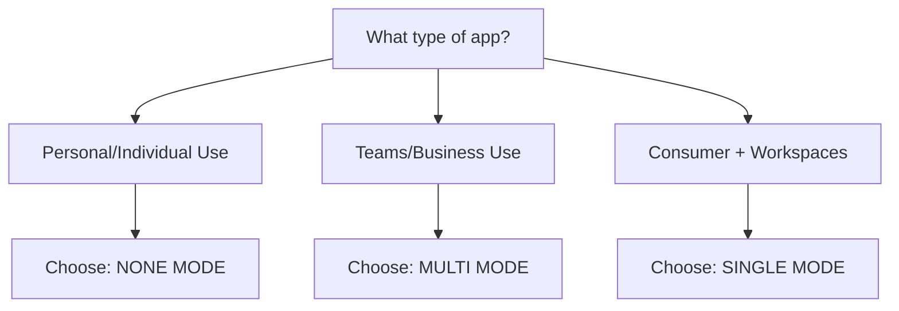

# Organization Mode Quick Reference

## 🚀 5-Minute Setup Decision Tree

### 1. What are you building?



### 2. Quick Setup After Cloning

```bash
# Step 1: Set your mode in .env.local
NEXT_PUBLIC_ORGANIZATION_MODE=multi  # or 'single' or 'none'

# Step 2: Generate the database schema
npm run db:generate-sql

# Step 3: Run the generated SQL in Supabase
# Copy contents of database-multi.sql to Supabase SQL Editor

# Step 4: Start developing!
npm run dev
```

**That's it! No additional setup needed.** The multi-tenant architecture is built-in.

## 📊 Mode Comparison

| Feature | None Mode | Single Mode | Multi Mode |
|---------|-----------|-------------|------------|
| **Use Case** | Personal apps | B2C with workspaces | B2B SaaS |
| **Examples** | Todo app, Personal blog | Notion (personal), Linear (personal) | Slack, Notion (teams), Asana |
| **Database Complexity** | Simple | Medium | Complex |
| **Performance** | ⚡ Fastest | ⚡ Fast | ⚡ Optimized |
| **Tables Created** | ~15 tables | ~20 tables | ~25 tables |
| **Organization Switching** | ❌ N/A | ❌ Hidden | ✅ Full UI |
| **Workspaces** | ❌ No | ✅ Auto-created | ✅ Multiple |
| **Team Features** | ❌ No | 🟡 Limited | ✅ Full |
| **Billing** | Per user | Per user | Per organization |
| **Setup Time** | 2 minutes | 3 minutes | 5 minutes |

## 🎯 Mode Selection Guide

### Choose `none` mode if:
- Building a personal productivity tool
- No team/collaboration features needed
- Want the simplest, fastest queries
- Examples: Personal todo, journal, portfolio

### Choose `single` mode if:
- B2C app with workspace organization
- Users work individually but need structure
- Want workspaces without org complexity
- Examples: Personal knowledge base, project tracker

### Choose `multi` mode if:
- Building B2B SaaS
- Need team collaboration
- Require enterprise features
- Want to sell to organizations
- Examples: Project management, CRM, Analytics

## 💡 Performance Impact

### None Mode Performance
```typescript
// Simplest queries - Direct user to resource
const items = await supabase
  .from('items')
  .select('*')
  .eq('user_id', user.id)  // Simple WHERE clause
```

### Single Mode Performance
```typescript
// One join - User → Organization → Resource
const items = await supabase
  .from('items')
  .select('*, projects(*)') 
  .eq('organization_id', org.id)  // Still simple
```

### Multi Mode Performance
```typescript
// Multiple joins possible but optimized
const items = await supabase
  .from('items')
  .select('*, projects(*, workspaces(*))')
  // RLS handles filtering - indexes make it fast
```

### Real-World Performance
- **None Mode**: ~5-10ms query time
- **Single Mode**: ~10-15ms query time
- **Multi Mode**: ~15-25ms query time

*All modes are production-ready and scale to millions of records*

## 🔄 Changing Modes Later

### Upgrade Path
- `none` → `single`: Add organization layer (medium effort)
- `none` → `multi`: Add full hierarchy (high effort)
- `single` → `multi`: Add workspace switching (low effort)

### Downgrade Path
- `multi` → `single`: Hide org switching (easy)
- `multi` → `none`: Remove organization layer (hard)
- `single` → `none`: Remove organization refs (hard)

**Recommendation**: Start with the mode that fits your 6-month vision.

## 📝 Mode-Specific Code

### None Mode Code
```tsx
// Simple and direct
function MyApp() {
  const { user } = useAuth()
  // Work directly with user resources
  return <UserDashboard userId={user.id} />
}
```

### Single Mode Code
```tsx
// Organization exists but hidden
function MyApp() {
  const { currentOrganization } = useOrganization()
  // Organization is auto-created per user
  return <WorkspaceDashboard />
}
```

### Multi Mode Code
```tsx
// Full organization features
function MyApp() {
  const { currentOrganization } = useOrganization()
  
  return (
    <>
      <OrganizationSwitcher />
      <TeamDashboard />
      <MemberList />
    </>
  )
}
```

## ✅ Quick Checklist

After setting your organization mode:

- [ ] Set `NEXT_PUBLIC_ORGANIZATION_MODE` in `.env.local`
- [ ] Run `npm run db:generate-sql`
- [ ] Execute generated SQL in Supabase
- [ ] Verify tables are created in Supabase Dashboard
- [ ] Check RLS policies are enabled
- [ ] Test with `npm run dev`

## 🤔 Still Unsure?

**When in doubt, choose `multi` mode.** It's easier to hide features than add them later.

You can run multi mode but:
- Hide the organization switcher
- Auto-create one org per user
- Disable team features

This gives you flexibility to grow without database migrations.